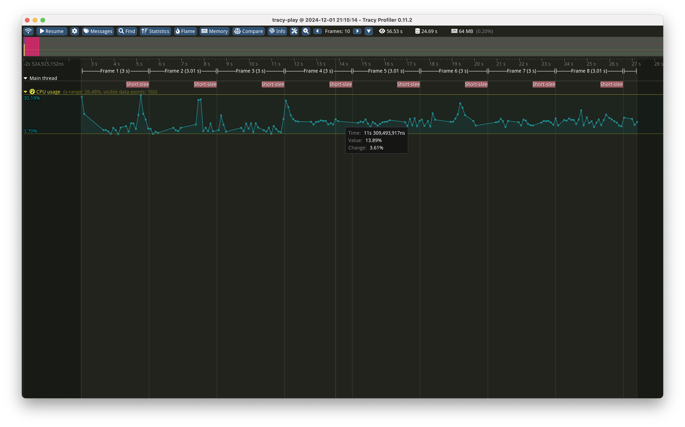

# tracy-play

Minimal example of using [Tracy](https://github.com/wolfpld/tracy);
took me a while to figure this out, so putting this here.

Tracy profiler UI:

```
$ git submodule update --init
$ cd tracy && cmake -B profiler/build -S profiler -DCMAKE_BUILD_TYPE=Release && cd profiler/build && make
$ ./tracy-profiler
```

Demo program:

```
$ make && ./tracy-play
```


